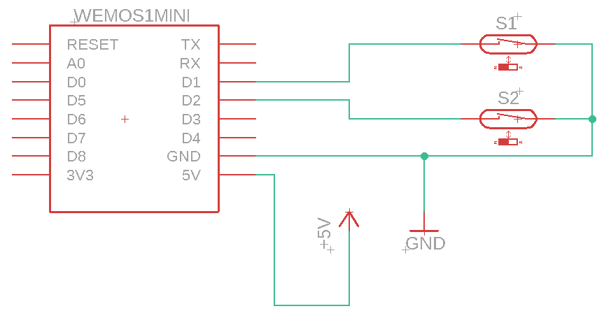

# esp8266-garage-door-sensors
Very simple project to monitor the status of the garage doors and send an MQTT message when the status changes.  It will publish messages on the `garageDoors` topic in the format `<door number>:<status>`, e.g.

`1:open`

## Parts List
- Wemos D1 mini
- Two reed switches, and magnets
- USB Power Supply

Many hardware stores sell door/window security sensors, which are basically reed switches and magnets in a plastic case that makes them very easy to mount.

## Building The Code
I've used Visual Studio Code and Platformio, but this will work equally well with the Arduino IDE.

### Install The Libraries
Only three additional libraries are required:
- FastLED
- xxtea-lib
- PubSubClient

### Configure Wifi / MQTT settings
All the networking config needs to be put in `include\wifiConfig.h`.  A template version is supplied.  Take a look at my esp8266-landing-lights project for details of how to obtain the encrypted information required.  The setting avaialble are:

- `SSID` - Your wifi SSID
- `WIFI_PASSWORD` - Your wifi password
- `MQTT_SERVER` - The address of the MQTT server to publish messages to
- `MQTT_PORT` - The port of your MQTT server
- `MQTT_USERNAME` - The username for the MQTT server
- `MQTT_PASSWORD` - The password for the MQTT server

## Wiring It Up

## Installation
Before installing, it's probably worth running it up on a bench so you can check how close the magnets need to be to the reed switches for them to operate.  After this, simply glue / screw the reed switches and magnets to each door and surround.  Power on an test.

